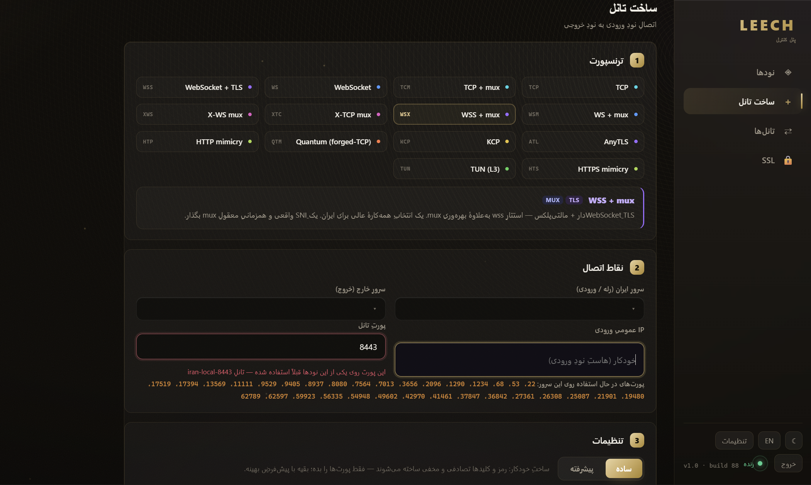

# LeechTunnel

Fast reverse tunnel with DPI‑evasion transports — a single obfuscated binary + an
interactive configurator + a web control panel. No dependencies, no build step.



---

## Install (one line)

Run on **every** server (inside + abroad), as **root**:

```bash
sudo -i
bash <(curl -fsSL https://raw.githubusercontent.com/ALIZA4004/LeechTunnel/main/install.sh)
```

Downloads the core + configurator into `/root/leech`, registers a `leech` command,
and opens the menu.

> 💡 **Recommended: use the web panel.** After installing on your servers, build and
> manage every tunnel from one browser (the panel, below) instead of the per‑server CLI
> menu — it's far easier and gives you live monitoring of every link.

### Manual install

```bash
mkdir -p /root/leech
curl -fL   -o /root/leech/leech    https://github.com/ALIZA4004/LeechTunnel/releases/latest/download/leech
curl -fsSL -o /root/leech/leech.sh https://raw.githubusercontent.com/ALIZA4004/LeechTunnel/main/leech.sh
chmod +x /root/leech/leech
cd /root/leech && bash leech.sh
```

## Menu (`leech`)

```
 1  Configure a new tunnel     (abroad = server · inside = client → point at abroad IP:port)
 2  Tunnel management
 3  Tunnel status
 4  Web panel   (install / connect / update)
 5  Update core     6  Update script     7  Remove
```

Each tunnel installs as a `systemd` service that starts on boot and auto‑reconnects.

## Web panel (recommended)

The easiest way to run LeechTunnel: build, monitor and control **every** tunnel from one
browser, instead of the menu on each server.

> **Requirement — SSH between servers.** The panel host (the **hub**) controls the other
> servers over **SSH**, so every server must have its SSH port (22) open and be reachable
> from the hub. All control and live metrics travel over that SSH link — nothing else is
> needed between servers.

Setup:

1. On one server (the **hub**) run `leech` → **4 → Install panel**. Enter a **port** and an
   **admin password** — it starts the panel and prints an **SSH key**.
2. Open `http://<hub-ip>:<port>` and log in with that password.
3. On **every other** server run `leech` → **4 → Connect to panel** and paste the key — this
   enrolls the server as a **node** (it adds the hub's key to the node's `authorized_keys`,
   so the hub can reach it over SSH).
4. Build and watch tunnels from the panel's **Create tunnel** / **Tunnels** tabs — a live
   topology graph with per‑tunnel throughput / CPU / RAM (see the screenshot above).

Keep the panel current with **4 → Update panel** (verified hot‑swap, auto‑rollback). EN / فارسی.

---

## نصب (فارسی)

روی **هر سرور** (داخل و خارج)، به‌عنوان **root**:

```bash
sudo -i
bash <(curl -fsSL https://raw.githubusercontent.com/ALIZA4004/LeechTunnel/main/install.sh)
```

> 💡 **پیشنهادِ ما: از پنلِ وب استفاده کن.** بعد از نصب روی سرورها، به‌جای منوی خط‌فرمانِ
> هر سرور، ساخت و مدیریتِ همهٔ تانل‌ها را از یک مرورگر انجام بده (پنل، پایین) — خیلی
> ساده‌تر است و مانیتورینگِ زندهٔ هر لینک را می‌دهد.

**ساختِ تانل با منو (اگر پنل نمی‌خواهی):** دستور `leech` → گزینهٔ **۱** — روی سرورِ **خارج**
حالتِ «server» و روی سرورِ **داخل** حالتِ «client» با IP و پورتِ سرورِ خارج. هر تانل سرویسِ
`systemd` می‌شود و با هر قطعی خودکار وصل می‌ماند.

### پنلِ وب (پیشنهادی)

ساده‌ترین راه: ساخت، کنترل و مانیتورینگِ **همهٔ** تانل‌ها از یک مرورگر.

> **پیش‌نیاز — SSH بینِ سرورها.** سرورِ پنل (**هاب**) بقیهٔ سرورها را از طریقِ **SSH** کنترل
> می‌کند؛ پس هر سرور باید پورتِ SSH‌اش (۲۲) باز و از هاب در دسترس باشد. تمامِ کنترل و آمارِ
> زنده از همین مسیرِ SSH رد می‌شود — چیزِ دیگری بینِ سرورها لازم نیست.

مراحل:

۱. روی یک سرور (**هاب**): `leech` → **۴ → Install panel** — یک **پورت** و یک **رمزِ ادمین**
   بده؛ پنل بالا می‌آید و یک **کلیدِ SSH** چاپ می‌کند.
۲. به `http://<hub-ip>:<port>` برو و با همان رمز وارد شو.
۳. روی **هر سرورِ دیگر**: `leech` → **۴ → Connect to panel** و همان کلید را بچسبان — آن سرور
   به‌عنوان **نود** اضافه می‌شود (کلیدِ هاب در `authorized_keys`اش قرار می‌گیرد تا هاب از راهِ
   SSH به آن برسد).
۴. از تب‌های **ساخت تانل** / **تانل‌ها** تانل بساز و زنده مانیتور کن — نمودارِ توپولوژی با
   ترافیک/CPU/RAMِ هر تانل (تصویرِ بالا).

بروزرسانیِ پنل: **۴ → Update panel** (هات‌سواپِ تأییدشده با بازگشتِ خودکار).
